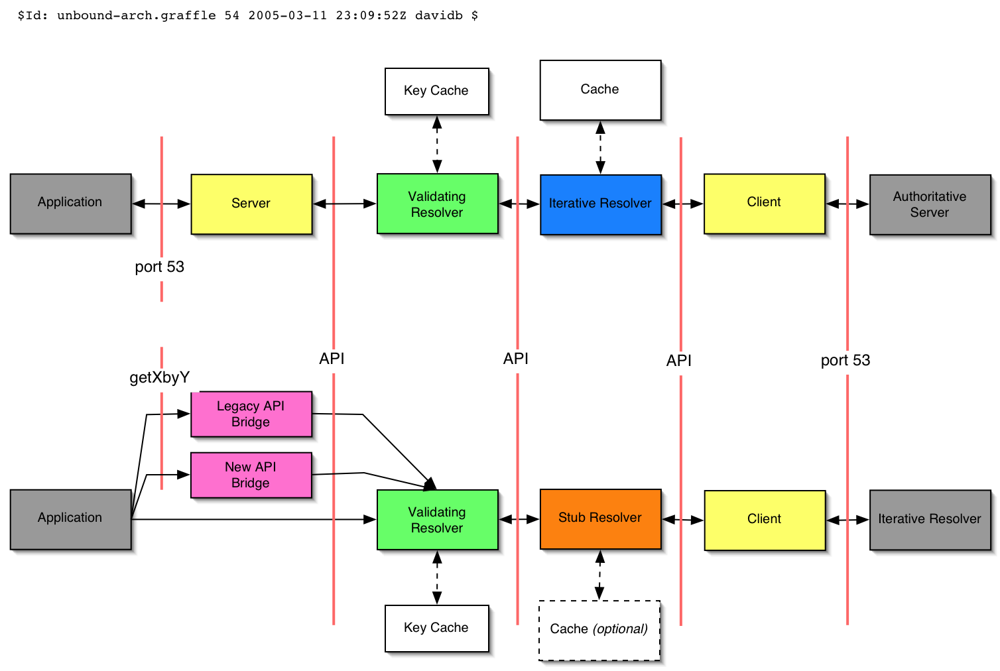

Unbound Resolver Prototype
==========================

*The following is information regarding the Java based prototype for Unbound.
The Java prototype was superseded by a C version, available* `here
<https://www.nlnetlabs.nl/projects/unbound/about/>`__. *Older prototype versions
can be downloaded* `here
<https://www.nlnetlabs.nl/downloads/unbound/proto-java>`__.

Unbound is a project to develop independent open-source DNS software and
documentation. It is jointly funded by `VeriSign, Inc.
<https://www.verisign.com>`_, and the `University of Southern
California/Information Sciences Institute <http://www.isi.edu>`_.

This is our prototype full-service, iterative-mode, validating DNS resolver.  It
is written entirely in Java and is licensed under the `BSD open-source license
<http://svn.verisignlabs.com/unbound/proto/trunk/licenses/unbound-LICENSE.txt>`_.

Even though it is a prototype, it is fairly full-featured:

- Supports DNSSEC validation
- Supports zone forwarding
- Supports "stub" zones
- Is resistant to cache poisoning
- Plus, other even harder to explain features!

Download the Original Java Prototype
------------------------------------

Fetch the latest package and released version here:

Binary:
    :download:`unbound-prototype-0.10.1.tar.gz <https://www.nlnetlabs.nl/downloads/unbound/proto-java/unbound-prototype-0.10.1.tar.gz>` | :download:`(sig) <https://www.nlnetlabs.nl/downloads/unbound/proto-java/unbound-prototype-0.10.1.tar.gz.asc>`
Source:
    :download:`unbound-prototype-0.10.1-src.tar.gz <https://www.nlnetlabs.nl/downloads/unbound/proto-java/unbound-prototype-0.10.1-src.tar.gz>` | :download:`(sig) <https://www.nlnetlabs.nl/downloads/unbound/proto-java/unbound-prototype-0.10.1-src.tar.gz.asc>`

.. Note:: As of unbound-prototype-0.10, support for `NSEC3 
          <http://www.nsec3.org>`_ validation is part of the trunk. Even more
          cutting edge versions (including branches) of the Java Prototype may
          be fetched via the `subversion repository
          <http://svn.verisignlabs.com/unbound/proto>`_.

The above is the link to the whole prototype area, which you probably don't want
to check out directly.  Instead, either check out the trunk or a single branch:

.. code-block:: bash

    svn co http://svn.verisignlabs.com/unbound/proto/trunk unbound-prototype

.. Tip:: Don't have subversion?  Don't even know what we are talking about?
         Head on over to the `subversion home <http://subversion.tigris.org>`_.

Prototype?
----------

Java, while a fine, fine language, isn't what we envision as the final
implementation language of the non-prototype resolver.  That would be C.  For
the prototype, however, Java was chosen because of the excellent `DNSjava
<http://www.dnsjava.org>`_ library and the familiarity with the same on the part
of one of the main developers.

The intent is to use a prototype to explore and validate a particular design for
an iterative-resolver and separable DNSSEC validator.

Design
------

The unbound-resolver was designed to be modular.  The idea was to create a
"chain" of modules that could be brought together to form either a full-service
resolver, or (for instance) a DNSSEC validating stub resolver.  It also is
designed to be able to use different implementations of a few key components,
like the cache.

Here is a diagram that shows the basic components.

In the image, "API" is referring to an internal API which is not standardized
*per-se*, but is internally consistent.

This version of the prototype has been written as an event-driven, asynchronous
server.  Each packet that is received is turned into an event (along with a few
internally generated events, like timeouts and generated queries).
